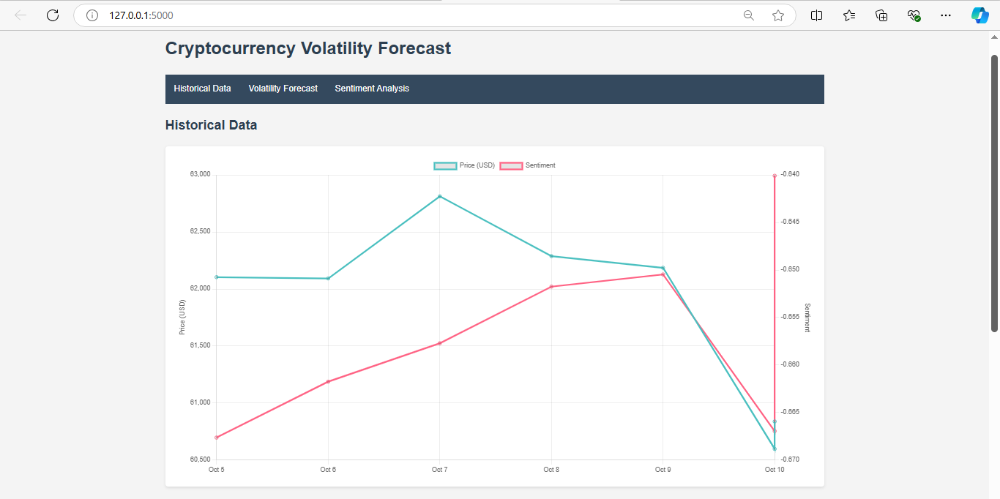
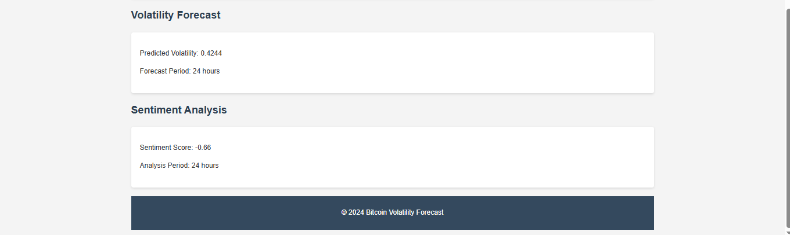

# Cryptocurrency Market Volatility Prediction

This project aims to predict cryptocurrency market volatility using social media sentiment analysis and historical market data. It combines data from various sources, performs sentiment analysis on social media content, and uses machine learning models to forecast market volatility.




## Table of Contents
1. [Project Overview](#project-overview)
2. [Features](#features)
3. [Installation](#installation)
4. [Usage](#usage)
5. [Data Pipeline](#data-pipeline)
6. [Model Selection and Training](#model-selection-and-training)
7. [API Endpoints](#api-endpoints)
8. [Web Interface](#web-interface)
9. [Continuous Improvement](#continuous-improvement)
10. [Contributing](#contributing)
11. [License](#license)

## Project Overview

This project leverages the power of social media sentiment and historical market data to predict cryptocurrency market volatility. It uses natural language processing techniques to analyze sentiment from platforms like Reddit, combines this with market data from CoinGecko, and employs machine learning models to forecast future market volatility.

## Features

- Real-time data collection from Reddit and CoinGecko API
- Sentiment analysis using DistilBERT model
- Historical data visualization
- Volatility prediction using Random Forest
- Web interface for easy interaction with the system

## Installation

1. Clone the repository:
   ```
   git clone https://github.com/charans2702/CrptoCurrency-Volatility-Prediction-based-on-social-media-SentimentAnalysis.git
   cd crypto-volatility-prediction
   ```

2. Install the required dependencies:
   ```
   pip install -r requirements.txt
   ```

3. Set up your Reddit API credentials in `data_pipeline.py`:
   ```python
   client_id = 'YOUR_CLIENT_ID'
   client_secret = 'YOUR_CLIENT_SECRET'
   user_agent = 'YOUR_USER_AGENT'
   ```

## Usage

1. Run the data pipeline to collect and process data:
   ```
   python data_pipeline.py
   ```

2. Start the Flask application:
   ```
   python app.py
   ```

3. Open a web browser and navigate to `http://localhost:5000` to access the web interface.

## Data Pipeline

The data pipeline (`data_pipeline.py`) is responsible for:

- Fetching social media data from Reddit
- Collecting cryptocurrency market data from CoinGecko
- Preprocessing text data
- Performing sentiment analysis
- Combining and preprocessing all features for model input

## Model Selection and Training

Our volatility prediction model is a crucial component of this project. We carefully considered various options and implemented a systematic approach to select and train the most effective model. Here's a detailed overview of our process:

### 1. Feature Engineering

Before model selection, we focused on creating a robust set of features:

- Market Data Features: We engineered features from historical price and volume data, including:
  - Price changes (daily, weekly)
  - Moving averages (7-day, 30-day)
  - Trading volume changes
  - Volatility indicators (e.g., Bollinger Bands)

- Sentiment Features: We aggregated sentiment scores from our social media data:
  - Daily average sentiment
  - Sentiment trend (change over time)
  - Sentiment volume (number of posts/comments)


- Lagged Features: To help the model capture temporal dependencies, we created lagged versions of key features (1-day, 3-day, 7-day lags)

### 2. Model Selection

We experimented with several types of models to find the best fit for our volatility prediction task:

1. Linear Models:
   - ARIMA (AutoRegressive Integrated Moving Average)
   - GARCH (Generalized AutoRegressive Conditional Heteroskedasticity)

2. Machine Learning Models:
   - Random Forest (our chosen model)
   - Gradient Boosting (XGBoost, LightGBM)


After extensive testing, we selected the Random Forest model for several reasons:

- Ability to capture non-linear relationships in the data
- Robust performance with high-dimensional feature spaces
- Built-in feature importance ranking, providing insights into key drivers of volatility
- Good balance between model complexity and interpretability
- Relatively fast training and prediction times

### 3. Training Process

Our training process involves several key steps:

1. Data Splitting: We use a time-based split to create our training and testing datasets. This approach ensures that we're not using future data to predict past events, which could lead to unrealistic performance metrics.

2. Cross-Validation: We implement a time-series cross-validation strategy, using multiple forward-chaining splits. This helps us assess how well our model generalizes to unseen data while respecting the temporal nature of our dataset.

3. Hyperparameter Tuning: We use grid search with cross-validation to find the optimal hyperparameters for our Random Forest model. Key parameters we tune include:
   - Number of trees in the forest
   - Maximum depth of the trees
   - Minimum number of samples required to split an internal node
   - Minimum number of samples required to be at a leaf node

4. Model Training: We train our model on the entire training dataset using the best hyperparameters found during the tuning process.

5. Feature Importance Analysis: After training, we analyze feature importances to understand which factors are most influential in predicting volatility. This insight can be valuable for future feature engineering and for providing interpretable results to users.

### 4. Evaluation

We evaluate our model using several metrics to get a comprehensive view of its performance:

- Mean Squared Error (MSE): Measures the average squared difference between predicted and actual volatility
- Mean Absolute Error (MAE): Measures the average absolute difference between predicted and actual volatility

### 5. Model Persistence

Once we're satisfied with our model's performance, we save it using joblib. This allows us to easily load the trained model for making predictions in our Flask application without needing to retrain it each time.

### 6. Ongoing Monitoring and Retraining

To ensure our model remains accurate over time:

- We continuously monitor its performance on new, unseen data.
- We've implemented a periodic retraining process to incorporate new data and adapt to changing market conditions.
- We track performance metrics over time to identify any degradation in model accuracy, which might indicate the need for feature engineering or model updates.

This comprehensive approach to model selection, training, and maintenance helps ensure that our volatility predictions remain as accurate and reliable as possible in the dynamic cryptocurrency market.


## API Endpoints

The Flask application (`app.py`) provides the following API endpoints:

- `/api/historical_data`: Returns historical price and sentiment data
- `/api/volatility_forecast`: Provides volatility predictions for the next 24 hours
- `/api/sentiment_analysis`: Returns the current sentiment analysis

## Web Interface

The web interface (`index.html` and `style.css`) provides a user-friendly way to interact with the system. It includes:

- Historical data visualization
- Current volatility forecast
- Sentiment analysis results

## Continuous Improvement

To continuously improve the model:

1. Regularly retrain the model with new data
2. Monitor prediction accuracy and adjust features or model parameters as needed
3. Stay updated with new developments in cryptocurrency markets and NLP techniques

## Contributing

Contributions are welcome! Please feel free to submit a Pull Request.

## License

This project is licensed under the MIT License - see the LICENSE file for details.